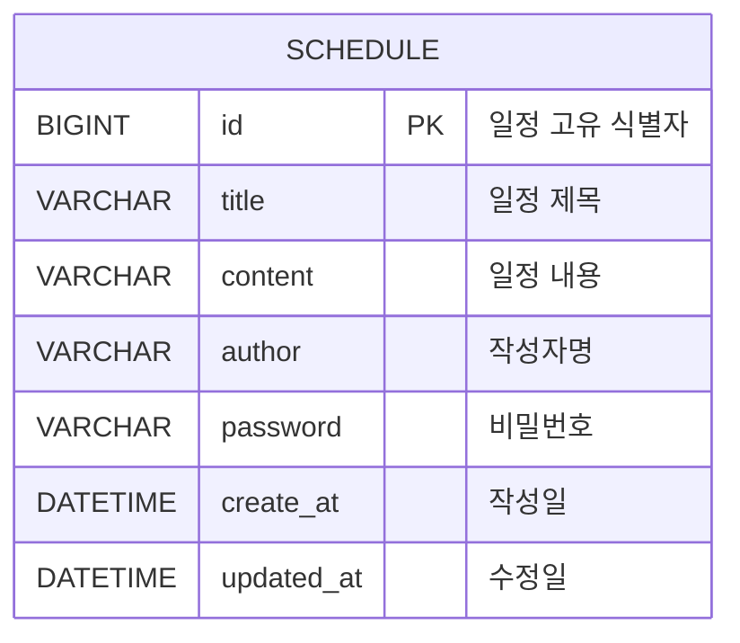

# Schedule_Mission

Java/Spring Boot와 JPA를 사용해 구현한 일정 관리 API 과제입니다.

## 기술 스택

- Java 17
- Spring Boot
- Spring Web
- Spring Data JPA
- MySQL
- Lombok

## 필수 기능

- 일정 생성
- 전체 일정 조회
- 작성자명 조건 일정 조회
- 선택 일정 단건 조회
- 선택 일정 수정
- 선택 일정 삭제
- 수정/삭제 시 비밀번호 검증
- 응답 데이터에서 비밀번호 제외
- 수정일 기준 내림차순 정렬

## ERD



## API 명세서

| 기능 | Method | URL | Query Parameter | Request Body | Response | Status |
| --- | --- | --- | --- | --- | --- | --- |
| 일정 생성 | POST | `/schedule` | 없음 | title, content, author, password | 생성된 일정 정보 | 201 Created |
| 전체 일정 조회 | GET | `/schedule` | 없음 | 없음 | 일정 목록 | 200 OK |
| 작성자명 조건 조회 | GET | `/schedule` | `author` 선택 | 없음 | 작성자명으로 필터링된 일정 목록 | 200 OK |
| 선택 일정 조회 | GET | `/schedule/{id}` | 없음 | 없음 | 선택한 일정 정보 | 200 OK |
| 선택 일정 수정 | PUT | `/schedule/{id}` | 없음 | title, author, password | 수정된 일정 정보 | 200 OK |
| 선택 일정 삭제 | DELETE | `/schedule/{id}` | 없음 | password | 없음 | 204 No Content |

## 요청 예시

### 일정 생성

```http
POST /schedule
Content-Type: application/json
```

```json
{
  "title": "Spring 일정",
  "content": "일정 관리 API 구현",
  "author": "예림",
  "password": "1234"
}
```

### 전체 일정 조회

```http
GET /schedule
```

### 작성자명 조건 조회

```http
GET /schedule?author=예림
```

작성자명 조건은 포함될 수도 있고 포함되지 않을 수도 있습니다.
조건이 없으면 전체 일정을 조회하고, 조건이 있으면 해당 작성자명의 일정만 조회합니다.
조회 결과는 수정일 기준 내림차순으로 정렬됩니다.

### 선택 일정 조회

```http
GET /schedule/1
```

### 선택 일정 수정

```http
PUT /schedule/1
Content-Type: application/json
```

```json
{
  "title": "수정된 일정 제목",
  "author": "수정된 작성자",
  "password": "1234"
}
```

일정 수정 시 일정 제목과 작성자명만 수정합니다.
비밀번호가 저장된 비밀번호와 일치해야 수정할 수 있습니다.

### 선택 일정 삭제

```http
DELETE /schedule/1
Content-Type: application/json
```

```json
{
  "password": "1234"
}
```

비밀번호가 저장된 비밀번호와 일치해야 삭제할 수 있습니다.

## 응답 예시

```json
{
  "id": 1,
  "title": "Spring 일정",
  "content": "일정 관리 API 구현",
  "author": "예림",
  "createAt": "2026-07-01T10:00:00",
  "updatedAt": "2026-07-01T10:00:00"
}
```

API 응답에는 비밀번호를 포함하지 않습니다.

## 상태코드

| 상황 | Status |
| --- | --- |
| 일정 생성 성공 | 201 Created |
| 조회 성공 | 200 OK |
| 수정 성공 | 200 OK |
| 삭제 성공 | 204 No Content |
| 요청값이 비어 있거나 잘못된 경우 | 400 Bad Request |
| 비밀번호가 일치하지 않는 경우 | 403 Forbidden |
| 선택한 일정이 존재하지 않는 경우 | 404 Not Found |

## 실행 방법

### 1. MySQL 데이터베이스 생성

```sql
CREATE DATABASE schedule_system;
```

### 2. 환경변수 설정

`application.properties`는 GitHub에 DB 계정과 비밀번호를 직접 올리지 않기 위해 환경변수를 사용합니다.

```properties
spring.datasource.username=${DB_USERNAME}
spring.datasource.password=${DB_PASSWORD}
```

실행 전 로컬 환경에서 다음 값을 설정해야 합니다.

```bash
export DB_USERNAME=본인_MYSQL_계정
export DB_PASSWORD=본인_MYSQL_비밀번호
```

### 3. 애플리케이션 실행

```bash
./gradlew bootRun
```

`./gradlew` 실행 권한이 없다면 다음 명령어를 먼저 실행합니다.

```bash
chmod +x gradlew
```

## 테스트

테스트 환경에서는 MySQL 대신 H2 인메모리 데이터베이스를 사용합니다.

```bash
./gradlew test
```
