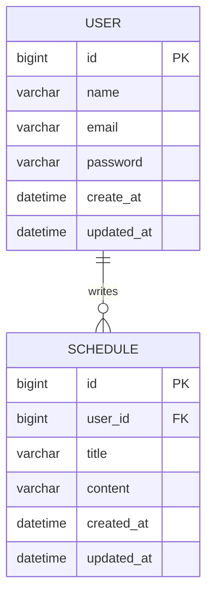

# Schedule Mission

Spring Boot와 JPA를 사용해 만든 일정 관리 과제입니다.
회원가입, 로그인, 일정 CRUD, 세션 기반 인증 흐름을 필수 기능 중심으로 구현했습니다.

> 구현 기준 브랜치: `feature/implemention2`

## 사용 기술

- Java 17
- Spring Boot
- Spring Web
- Spring Data JPA
- MySQL
- Gradle

## 실행 방법

먼저 MySQL 데이터베이스와 계정 권한을 준비합니다.

```sql
CREATE DATABASE schedule_mission
DEFAULT CHARACTER SET utf8mb4
COLLATE utf8mb4_unicode_ci;

GRANT ALL PRIVILEGES ON schedule_mission.* TO 'yeang'@'localhost';
FLUSH PRIVILEGES;
```

환경 변수는 로컬 DB 계정에 맞게 설정합니다. 기본 사용자명은 `yeang`으로 두었고, 비밀번호가 있다면 `DB_PASSWORD`를 지정합니다.

```bash
export DB_USERNAME=yeang
export DB_PASSWORD=비밀번호
```

프로젝트 실행은 `260705` 디렉토리에서 진행합니다.

```bash
cd 260705
./gradlew bootRun
```

## ERD



## API 명세

### User API

| 기능 | Method | URL | Request | Response | Status |
| --- | --- | --- | --- | --- | --- |
| 회원가입 | POST | `/c_userSignUp` | name, email, password | id, name, email, createAt | 201 Created |
| 로그인 | POST | `/c_userLogin` | email, password | - | 200 OK |
| 유저 단건 조회 | GET | `/c_user/{id}` | path id | id, name, email, createAt, updatedAt | 200 OK |
| 유저 전체 조회 | GET | `/c_user` | - | 유저 목록 | 200 OK |
| 유저 이름 수정 | PATCH | `/c_user` | name | id, name, email, updatedAt | 200 OK |
| 유저 삭제 | DELETE | `/c_user/{id}` | path id | - | 204 No Content |

### Schedule API

| 기능 | Method | URL | Request | Response | Status |
| --- | --- | --- | --- | --- | --- |
| 일정 생성 | POST | `/20020707` | title, content | id, userId, userName, title, content, createdAt, updatedAt | 201 Created |
| 일정 단건 조회 | GET | `/20020707/{id}` | path id | id, userId, userName, title, content, createdAt, updatedAt | 200 OK |
| 일정 전체 조회 | GET | `/20020707` | - | 일정 목록 | 200 OK |
| 일정 수정 | PUT | `/20020707/{id}` | title, content | id, userId, userName, title, content, updatedAt | 200 OK |
| 일정 삭제 | DELETE | `/20020707/{id}` | path id | - | 204 No Content |

## 요청 예시

### 회원가입

```json
{
  "name": "yeang",
  "email": "yeang@example.com",
  "password": "password123"
}
```

### 로그인

```json
{
  "email": "yeang@example.com",
  "password": "password123"
}
```

### 일정 생성 / 수정

```json
{
  "title": "Spring 과제",
  "content": "일정 관리 앱 구현"
}
```

## 응답 상태 코드

| Status | 의미 |
| --- | --- |
| 200 OK | 조회, 수정, 로그인 성공 |
| 201 Created | 생성 성공 |
| 204 No Content | 삭제 성공 |
| 400 Bad Request | 잘못된 요청 값 |
| 401 Unauthorized | 로그인 필요 또는 로그인 실패 |
| 403 Forbidden | 본인 또는 작성자가 아닌 사용자의 수정/삭제 요청 |
| 404 Not Found | 존재하지 않는 데이터 조회 |

## 구현 체크리스트

- [x] 3 Layer Architecture 적용
- [x] JPA와 MySQL 사용
- [x] 일정 생성 / 전체 조회 / 단건 조회 / 수정 / 삭제 구현
- [x] 유저 생성 / 전체 조회 / 단건 조회 / 수정 / 삭제 구현
- [x] Cookie/Session 기반 로그인 구현
- [x] 로그인 세션 기반 일정 생성, 수정, 삭제 제한
- [x] DTO 기반 요청/응답 처리
- [x] Entity를 그대로 응답하지 않도록 분리
- [x] JPA Auditing 기반 작성일 / 수정일 관리
- [x] README에 API 명세서와 ERD 정리
